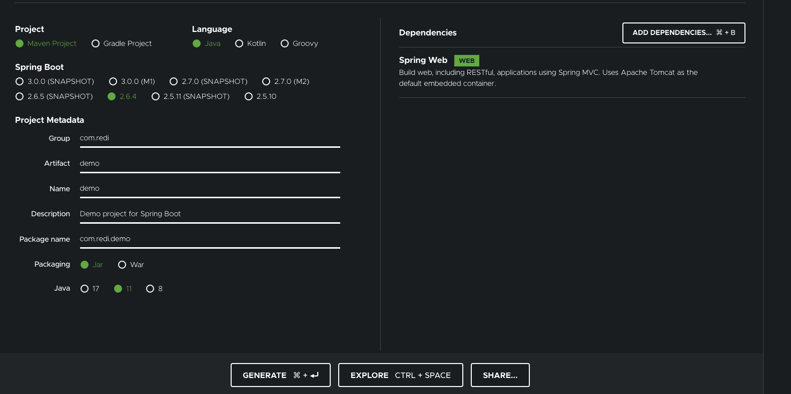
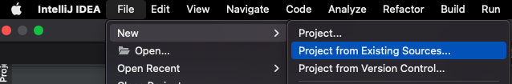
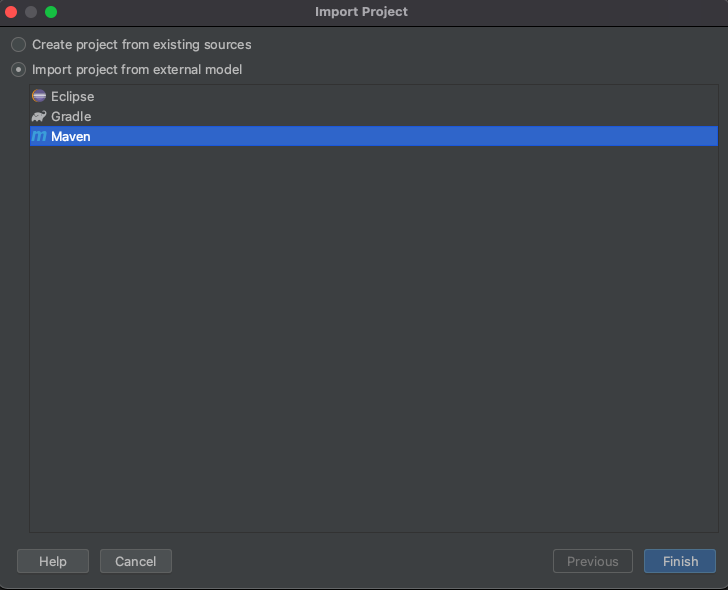

# Spring boot Intro


##What You Will Build
You will build a service that will accept HTTP GET requests at
```shell
curl http://localhost:8080/greeting
```

It will respond with a JSON representation of a greeting, as the following listing shows:
```json
{"id":1,"content":"Hello, World!"}
```
You can customize the greeting with an optional name parameter in the query string, as the following listing shows:
```shell
curl http://localhost:8080/greeting?name=User
```
The name parameter value overrides the default value of World and is reflected in the response, as the following listing shows:
```json
{"id":1,"content":"Hello, User!"}
```

##What You Need
- About 15 minutes
- A favorite text editor or IDE
- JDK 11 or later
- Maven 3.2+

##How to complete this task:
Go to this [link](https://start.spring.io/#!type=maven-project&language=java&platformVersion=2.6.4&packaging=jar&jvmVersion=11&groupId=com.redi&artifactId=demo&name=demo&description=Demo%20project%20for%20Spring%20Boot&packageName=com.redi.demo&dependencies=web)
or follow the manual setup steps:
1. Navigate to [https://start.spring.io](https://start.spring.io).
1. select Maven Project
1. select Java as language
1. leave the spring boot version already selected this normally is the latest stable release
1. Group: `com.redi`
1. Artifact: select a name or leave it with the default `demo`
1. packaging will be the default one: `Jar`
1. Java version 11
1. add the `Spring web` dependency by clicking `ADD DEPENDENCIES` and searching by name
   configuration should look like:



Download the resulting ZIP file and unzip it, which is an archive of a web application that is configured with your choices.

## Importing project into Intellij
1. open Intellij
1. Go to File -> New -> Project from existing sources

1. select the unziped folder containing the downloaded project
1. select `import project from external model` maven

1. click Finish and wait for the project to build

   
## Review project structure
- Main code goes into the `src/main` folder
- the application class should be created within `src/main/com/redi/demo` with name ´DemoApplication´ or the name of the application you choose when creating the project
```java
@SpringBootApplication
public class DemoApplication {

	public static void main(String[] args) {
		SpringApplication.run(DemoApplication.class, args);
	}

}
```
- resources folder in `src/main/resources` allows us to store html files, images and configuration between others
- inside the resources folder you can find the `application.properties` file, this file allows you to configure multiple aspects of spring or the modules you are using.
- Test code goes into the `src/test`
- there is an integration test case added by default in `src/test/java/com/redi/demo/` with name `DemoApplicationTest`
  you can run this test case by right click over the class name and select `Run DemoApplicationTest`
  
## How to start the server
1. click terminal in the buttom of the intellij or navigate using a console to the project root directory
1. build the project by running
```
mvn clean install
```
1. run the following command
```
mvn spring-boot:run
```
1. check the service is running by going to the following url:
```
http://localhost:8080
```

## add the Greetings controller:
1. In the left-hand side, right click inside the folder `com.redi.demo` and select new -> Package, give it the name `controller`
1. Right click inside the newly created folder `controller` and select new -> Java Class, give it the name `GreetingController`
1. annotate the class with the `@RestController` annotation this lets spring knows this is a class that will be exposed using http endpoints.
1. create a new method that takes no parameters and return the String `Hello, World`
1. annotate the method with the `@GetMapping` annotation and pass to the annotation the name of the path in this case `greeting`
the class should look like:
```java
@RestController
public class GreetingController {

    @GetMapping("greeting")
    public String greet() {
        return "Hello, World!";
    }
}
```
1. test it by opening the following url:
```
http://localhost:8080/greeting
```

## Introduce a request parameter
request parameters let us control the behavior of our endpoints, in this case we want to say hello to the user that is
making a call to our endpoint. we can achieve it by providing the name of the user in the request
```
http://localhost:8080/greeting?name=User
```
1. add a String parameter call `name` to the greet method
1. annotate the parameter using the `@RequestParam` annotation
1. indicate the name of the request parameter in the request, by providing a value argument `value="name"`
1. we can also provide a defaultValue to the request param in case is not send by the user, `defaultValue="World"``
1. use the variable name to print it in the response
our class should look like:
```java
@RestController
public class GreetingController {

    @GetMapping("greeting")
    public String greet(@RequestParam(value = "name", defaultValue = "World") String name) {
        return "Hello, " + name + "!";
    }
}
```
you can test it by calling:
```
http://localhost:8080/greeting?name=your_name_here
```
## Introduce a json response
most of the time frontend applications will communicate with backend using json as response types.
luckily spring allow us to do this out of the box.
1. In the left-hand side, right click inside the folder `com.redi.demo` and select new -> Package, give it the name `domain`
1. Right click inside the newly created folder `domain` and select new -> Java Class, give it the name `Greeting`
1. add two fields to this class `id` and `content`
your class should look like:
```
public class Greeting {

	private final long id;
	private final String content;

	public Greeting(long id, String content) {
		this.id = id;
		this.content = content;
	}

	public long getId() {
		return id;
	}

	public String getContent() {
		return content;
	}
}   
```
1. modify the controller so that you create a new instance of the Greeting Class on every request
1. content should be equals to `Hello, ` + name + !
1. populate the id using a AtomicLong:
```
AtomicLong counter = new AtomicLong();
counter.incrementAndGet()
```
your method signature should look like:
```java
@RestController
public class GreetingController {
    
    // some variable definition
    
    @GetMapping("greeting")
    public Greeting greet(@RequestParam(value = "name", defaultValue = "World") String name) {
        // create a new instance of Greeting
        // return new instance of Greeting
    }
}
```
you can test it by using the same request as before:
```
http://localhost:8080/greeting?name=your_name_here
```
but this time the response must be:
```json
{"id":1,"content":"Hello, World!"}
```

